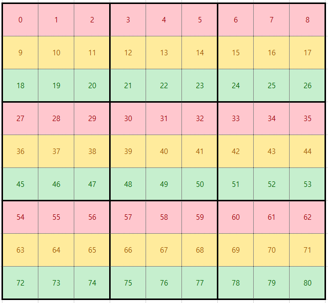

Heesang Mark Whang

CSCI 440: Artificial Intelligence

Assignment #4

10/30/2019

1. **(5 points)** You get full points if either
   
   * all the rest of the assignment elements work or ...
   * you spend a considerable amount of time working on trying to get the assignment working
     * Record the approximate amount of time working on the assignment
  * Detail the parts you struggled with and your attempts to get them working

2. Sudoku can be viewed as CSP(Constraints Satisfaction Problem).
   * The **variables** are *the individual cells, numbers 0 to 80,* based on the location on the board. A cell located in row A (can be 0 to 8) and column B (can be 0 to 8), will have index 9*A+B.
   
   * The **constraints** are converted to binary constraints and given by the constraints graph, represented by a *boolean matrix C\[81]\[81]* where C\[X]\[Y]=true if and only if cells x and y must be different (i.e. x and y are in the same row, same column, or same 3x3 sub-grid).
   
   * The **domain** for each of the variables are the numbers 1 to 9 and represented by *an array of vectors, vector<int> domain\[81].* Each individual Sudoku puzzle comes with a predefined assignment of values for particular cells (unary constraints). We reflect these unary constraints immediately on the domain. For example, if cell (variable) indexed by 70 is defined by puzzle to be 4, then domain\[70]={4} (instead of {1,2,3,4,5,6,7,8,9}).
   
   * An **assignment** is the assigning of specific value to each cell (variable) and is represented by *a vector of integers, vector<int> assignment*.
   
   * Furthermore we define a structure for each binary constraint which is an arc in the constraint graph.
   
     ```C++
     struct arcType {
     	int source;
     	int destination;
     };
     ```
   
     So the *constraint that xi and xj must be different can be represented by arcType c={xi, xj}*. This representation will be useful when implementing the AC-3 algorithm.
     
   
   a) (**1 point**) Implement the revise function with pseudocode shown in Figure 6.3, page 209.
   
   ```C++
   bool revise(int xi, int xj, vector<int> domain[81], const bool C[81][81])
   {
   	bool revised = false;
   
   	if (C[xi][xj]) { // If constraint exists between two cell, go through revision check
   		for (int i_idx = 0; i_idx < domain[xi].size(); i_idx++) { // Loop through Domain of (xi)
   			bool satisfied = false; // Initially unsatisfied
   
   			for (int j_idx = 0; j_idx < domain[xj].size(); j_idx++) // Loop through Domain of (xj)
   				if (domain[xi][i_idx] != domain[xj][j_idx]) satisfied = true; // some value satisfies constraint
   			
   			if (!satisfied) { // if no value in domain[xj] satisfy constraint with value domain[xi][i_dix]
   				domain[xi].erase(domain[xi].begin() + i_idx); // remove unsatisfied value domain[xi][i_dix]
   				revised = true;
   			}
   		}
   	}
   	return revised;
   }
   
   ```
   
   b) (**1 point**) Implement the arc-consistency algorithm AC-3 with pseudocode shown in Figure 6.3, page 209. A suggestion is to make the queue a queue of *arcType*, and initialize it by all the arcs {xi, xj} that satisfy *C\[xi]\[xj]==true*.
   
   ```C++
   bool AC3(vector<int> domain[81], const bool C[81][81])
   {
   	queue<arcType> arcs;
   	for (int xi = 0; xi < 81; xi++) { // Initialize arcType queue that satisfies C[xi][xj]
   		for (int xj = 0; xj < 81; xj++) {
   			if (C[xi][xj]) {
   				arcType tmpArc = {xi, xj};
   				arcs.push(tmpArc);
   			}
   		}
   	}
   
   	// Neighbor index calculation factors
   	/*------------------------- general
   	(xi-10)[0] | (xi-9) [1] | (xi-8)  [2]
   	(xi-1) [3] |     xi     | (xi+1)  [4]
   	(xi+8) [5] | (xi+9) [6] | (xi+10) [7]
   	---------------------------*/
   	int neighbor_idx_calc[] = {-10, -9, -8, -1, 1, 8, 9, 10};
   
   	while (!arcs.empty()) {
   		// Remove-first(queue)
   		arcType first = arcs.front();
   		arcs.pop();
   
   		// Determine if first.source is left-most or right-most index
   		char pos = 'G'; // L: leftmost, R: rightmost, G: general
   		if (first.source%9) pos='L';
   		if ((first.source+1)%9==0) pos='R';
   
   		if (revise(first.source, first.destination, domain, C)) { // if revised
   			if (domain[first.source].empty()) return false; // if domain is empty, no solution
   			
   			// Get neighboring index of source arc (xi)
   			for (int i = 0; i < 8; i ++) { // total of 8 neighbors
   				if (pos='L') // skip left neighbors
   					if (i == 0 || i == 3 || i == 5) continue;
   				if (pos='R') // skip right neighbors
   					if (i == 2 || i == 4 || i == 7) continue;
   
   				int xk = first.source + neighbor_idx_calc[i];
   				if (xk < 0) continue; // skip neighbor less than row 1
   				else if (xk > 80) continue; // skip neighbor more than last row
   				else if (xk == first.destination) continue; // xk == xj
   				else {
   					arcType newArc = {xk, first.source}; // {xk, xi}
   					arcs.push(newArc); // add (xk, xi) to queue
   				}
   			}
   		}
   	}
   	return true;
   }
   ```
   
   c) (**1 point**) A basic implementation of the backtrack algorithm on Figure 6.5, page 215 is given to you (called *backtrackCSP*). It does not do any inference or use any heuristics. Implement the backtrack algorithm with the MRV heuristics built in. You can build the function from scratch, or you can make a simple modification the function provided. The variable count keeps track of how many variables have already been assigned.
   
   ```C++
   vector<int> backtrackCSP_MRV(vector<int> assignment, int count, vector<int> domain[81], const bool C[81][81])
   {
   	vector<int> result;
   	if (count >= 81) //if assignment complete
   		return assignment;
   	//pick the next unassigned variable
   	int r = 0;
   	vector<int> emptyIndex; // vector of empty indexes
   	vector<int> domainSize; // vector of domain size
   	for (int r = 0; r < 81; r++) { // find all empty index
   		if (assignment[r] == 0) {
   			emptyIndex.push_back(r);
   			domainSize.push_back(domain[r].size());
   		}
   	}
   	r = emptyIndex[distance(domainSize.begin(),min_element(domainSize.begin(), domainSize.end()))]; // pick the most contrained domain
   	int n = domain[r].size();
   	for (int i = 0; i < n; i++)
   	{
   		int value = domain[r][i];  //pick the next value
   
   		//check for if value is consitent with the past
   		bool consistent = true;
   		for (int j = 0; j < 81; j++)
   			if (j != r && C[r][j] && assignment[j] == value)
   			{
   				consistent = false;
   				break;
   			}
   		if (consistent)
   		{
   			assignment[r] = value;
   			result = backtrackCSP(assignment, count + 1, domain, C);
   			if (result.size() > 0)
   				return result;
   			assignment[r] = 0;
   		}
   	}
   	return result;
   }
   ```
   
   d) (**2 points**) You are given a sets of puzzle in the main function.
   
   * Run the backtrackCSP and backtrackCSP_MRV algorithms on the puzzles. Record the average time to solve them.
   * Apply AC3 to each puzzle, then run backtrackCSP and backtrackCSP_MRV algorithms on them. Record the average time to solve them.
   
   Record the results in the table below:
   
   |                       | Backtrack | Backtrack+MRV | Backtrack+AC3 | Backtrack+AC3+MRV |
   | --------------------- | :-------: | :-----------: | :-----------: | :---------------: |
   | Average Solution time | 11.7707 s |   11.6292 s   |   8.7705 s    |     6.23201 s     |
   


* Image to assist each cell's index ID
